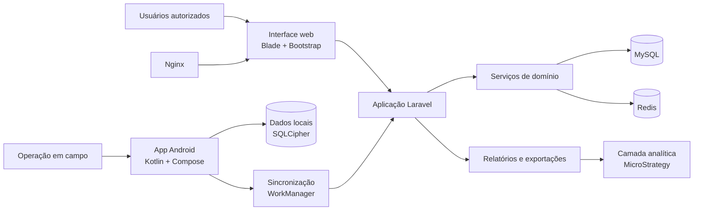

# Diagrama de componentes

Diagrama conceitual e sanitizado da solução:

```mermaid
flowchart LR
    U[Usuários autorizados] --> W[Interface web\nBlade + Bootstrap]
    C[Operação em campo] --> P[App Android\nKotlin + Compose]
    W --> A[Aplicação Laravel]
    P --> O[(Dados locais\nSQLCipher)]
    P --> S[Sincronização\nWorkManager]
    S --> A
    A --> D[Serviços de domínio]
    D --> M[(MySQL)]
    D --> R[(Redis)]
    A --> Q[Relatórios e exportações]
    Q --> B[Camada analítica\nMicroStrategy]
    N[Nginx] --> W
```

As conexões são ilustrativas e não representam nomes, endereços, portas ou topologia de produção.
