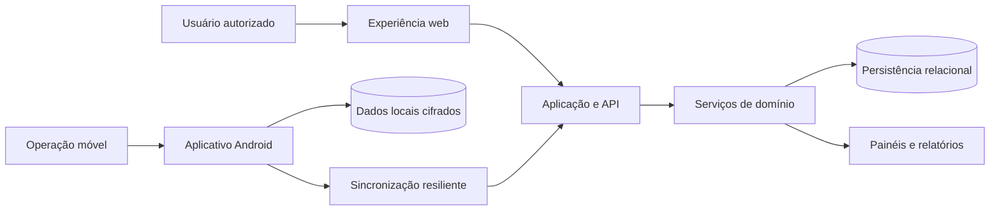

# Diagrama conceitual de componentes

```mermaid
flowchart LR
    U[Usuário autorizado] --> W[Experiência web]
    M[Operação móvel] --> A[Aplicativo Android]
    A --> L[(Dados locais cifrados)]
    A --> S[Sincronização resiliente]
    W --> H[Aplicação e API]
    S --> H
    H --> D[Serviços de domínio]
    D --> B[(Persistência relacional)]
    D --> R[Painéis e relatórios]
```

O desenho demonstra responsabilidades, não topologia. Nomes, conexões, volumes e limites de produção não são publicados.
